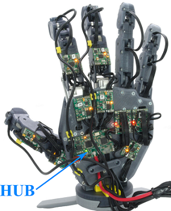

# PUT-Hand-Firmware-HUB

## About

PUT-Hand is an open-source project of a 5-finger anhomomorphic gripper. PUT-Hand is designed to manipulate wide range of object including elastic objects. PUT-Hand was designed using as many off-the-shelf parts and FDM 3D printing technology, with single elements requiring aluminium CNC machining or stainless steel turning. The [PUT-Hand repositories](https://github.com/puthand) include all parts necessary to recreate the proposed design: mechanical files, PCB design and firmware.

PUT-Hand-Firmware-HUB repository contains firmware (STM32F0) for HUB unit - integration unit serving as a bridge between each separate DRIVER and high-level controller.



### HUB schematics

<https://github.com/puthand/PUT-Hand-PCB/blob/master/PUT-Hand-HUB.PDF>

### HUB gerber files

<https://github.com/puthand/PUT-Hand-PCB/tree/master/PUT-Hand-HUB>

## Tools

* SW4STM32 - System Workbench for STM32 - <http://www.openstm32.org>
* ST-LINK/V2 or compatible emulator

## Usage

1. Open PUT-Hand-Firmware-HUB project using System Workbench for STM32.
2. Edit DRIVER modules address list in [./src/main.c](./src/main.c) file:

```C
const uint8_t drvList_Addresses[MotorDriver_Count] =  { .... };
```

3. Compile and upload firmware.

## Acknowledgments

* base64.c by Joe DF, MIT License - <https://github.com/joedf/base64.c>

## License

Unless stated otherwise, PUT-Hand project elements are licensed under a [Creative Commons Attribution-NonCommercial 4.0 International](https://creativecommons.org/licenses/by-nc/4.0/) (CC BY-NC 4.0). Accompanying firmware and software are licensed under a [MIT License](https://opensource.org/licenses/MIT).
